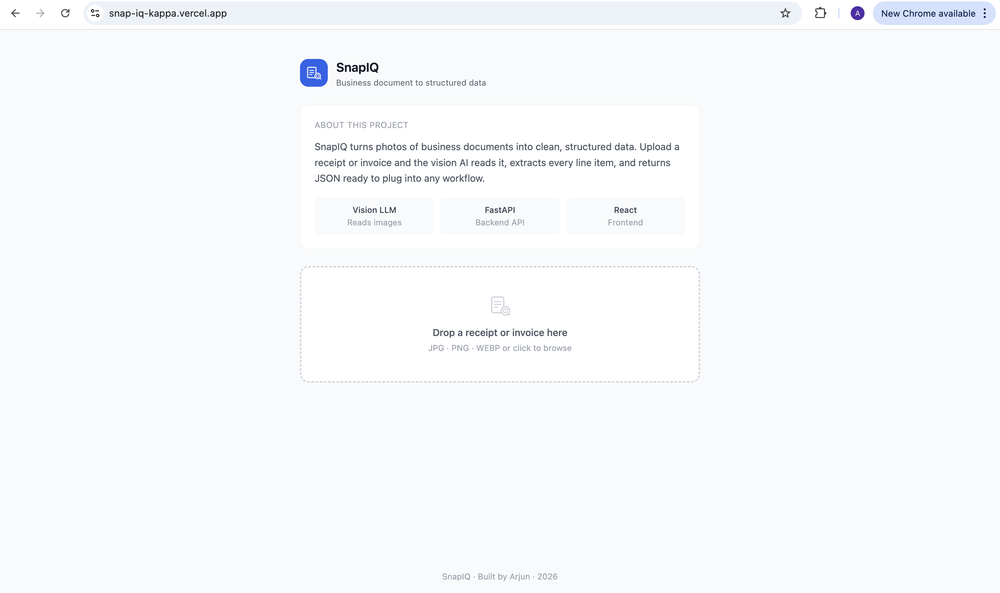
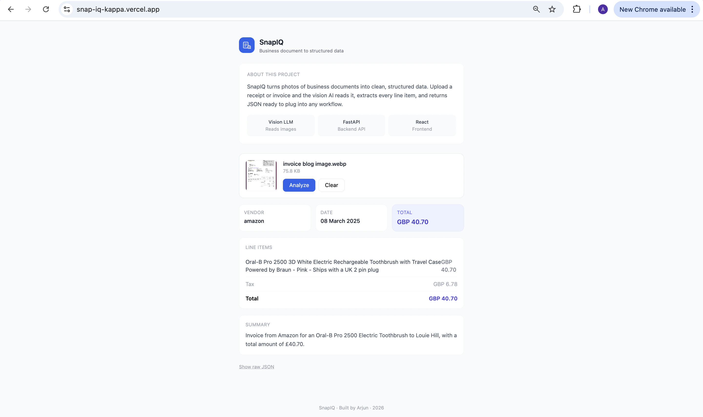

# SnapIQ: Vision-Powered Document Intelligence

> Upload a photo of any business document. Get back clean, structured data — vendor, date, line items, totals — ready to plug into any workflow.

**Live Demo:** [snap-iq-kappa.vercel.app](https://snap-iq-kappa.vercel.app)
**Backend API:** [snap-iq.onrender.com/health](https://snap-iq.onrender.com/health)
**Author:** Arjun A N

---

## What are we looking at?

Most document AI projects work with clean digital text — PDFs you can copy from, spreadsheets you can parse, APIs that return JSON.

This project handles the messiest input in any business: a photo.

Invoices that arrive as WhatsApp images. Receipts photographed on a desk. Delivery notes scanned on a phone. SnapIQ reads them the same way a human would — by looking at them — and returns structured data in milliseconds.

This is multimodal AI engineering: combining vision and language in a single inference call to extract meaning from unstructured visual input.

---



## The problem it solves

Every automation pipeline has a physical world problem. You can build the most sophisticated ERP workflow in the world, but if your invoices arrive as photos, someone still has to manually read them and type the data in.

That manual step is the bottleneck. It is slow, error-prone, and does not scale.

SnapIQ removes it. Upload the image, get the JSON, pipe it wherever you need it.

**Target users:** Finance teams, operations managers, small business owners, and developers building document automation pipelines who need to extract structured data from business document images without manual entry.

---

## How it works

### 1. Image capture and encoding

The user uploads an image from any device. The frontend reads the file, converts it to base64, and sends it as a multipart form to the backend API.

Base64 encoding is how binary image data travels safely over HTTP as text. This is the standard pattern for vision API integrations.

### 2. Vision inference

The FastAPI backend receives the image and constructs a multimodal request: a structured extraction prompt paired with the raw image bytes, sent together to a vision-capable LLM.

The model reads the image the same way a human does — it sees the layout, recognizes vendor logos, reads printed text, understands table structure — and follows the prompt to return only a JSON object.

```
Image upload (JPG / PNG / WEBP)
     |
Base64 encode in browser
     |
POST /analyze (FastAPI backend)
     |
Multimodal prompt + image bytes sent to Vision LLM
     |
Model reads image, extracts fields
     |
JSON: vendor · date · currency · line items · tax · total · summary
     |
React renders structured result card
```

### 3. Structured extraction prompt

Prompt engineering is what separates a demo from a reliable system. The extraction prompt instructs the model to return only a strict JSON schema with no markdown, no explanation, and no additional text. It specifies every field by name and type, including null handling for fields that may not appear on every document.

This makes the output predictable and parseable every time, regardless of document type or layout.

### 4. JSON parsing and validation

The backend strips any residual markdown fences the model may add, parses the JSON, and validates it against a Pydantic schema before returning it to the frontend. If parsing fails, a 422 error is returned with a clear message rather than silently serving corrupt data.

### 5. The result card

The frontend renders vendor, date, and total as metric cards, line items as a structured table with individual amounts, a plain-English summary generated by the model, and a raw JSON toggle for developers who want to inspect the full response.




---

## Tech stack

| Layer | Technology | Role |
|-------|-----------|------|
| Vision LLM | Multimodal model via OpenRouter | Reads image and extracts structured data |
| Backend | FastAPI (Python) | REST API, image handling, prompt construction |
| Validation | Pydantic | JSON schema enforcement on API response |
| Frontend | React + Vite | Single-page upload and result interface |
| Styling | Tailwind CSS | Utility-first component styling |
| Backend hosting | Render (free tier) | Always-on Python server |
| Frontend hosting | Vercel (free tier) | Global CDN deployment |

**Total infrastructure cost: $0**

---

## API

### POST /analyze

Accepts a multipart image upload. Returns structured document data.

**Request**
```
Content-Type: multipart/form-data
Body: file=<image file>
```

**Response**
```json
{
  "vendor": "Amazon",
  "date": "08 March 2025",
  "currency": "GBP",
  "line_items": [
    {
      "description": "Oral-B Pro 2500 Electric Toothbrush",
      "quantity": 1,
      "unit_price": 40.70,
      "amount": 40.70
    },
    {
      "description": "Shipping Charges",
      "quantity": null,
      "unit_price": null,
      "amount": 0.00
    }
  ],
  "subtotal": null,
  "tax": 6.78,
  "total": 40.70,
  "summary": "Invoice from Amazon for an Oral-B electric toothbrush with travel case. Total amount due is GBP 40.70 including VAT."
}
```

### GET /health

Returns `{"status": "ok"}` — used to verify the backend is running.

---

## Running locally

**Prerequisites:** Python 3.9+, Node.js 18+

**Backend**
```bash
cd backend
python -m venv .venv
source .venv/bin/activate
pip install -r requirements.txt

# Add your OpenRouter API key
echo "OPENROUTER_API_KEY=your_key_here" > .env

uvicorn main:app --reload
```

Backend runs at `http://localhost:8000`

**Frontend**
```bash
cd frontend
npm install
echo "VITE_API_URL=http://localhost:8000" > .env
npm run dev
```

Frontend runs at `http://localhost:5173`

Get a free OpenRouter API key at [openrouter.ai](https://openrouter.ai). No credit card required.

---

## What makes this AI engineering, not just AI

| Typical vision demo | SnapIQ |
|---------------------|--------|
| "Describe this image" | Structured field extraction with a strict JSON schema |
| Single hardcoded model | Model-agnostic via OpenRouter — swap models without code changes |
| No error handling | Pydantic validation, JSON parse fallback, typed HTTP errors |
| Frontend calls API directly | Dedicated backend handles encoding, prompt construction, parsing |
| Works on one document type | Handles receipts, invoices, delivery notes, any business document |
| Local script | Deployed, publicly accessible system |

---

## Honest limitations

**Model variability:** The model occasionally misreads handwritten amounts or low-resolution images. Printed, high-contrast documents produce the most reliable output.

**Render cold start:** The backend runs on Render's free tier, which spins down after 15 minutes of inactivity. The first request after sleep takes approximately 60 seconds to wake up. This is a hosting constraint, not an application one.

**Currency detection:** Currency is inferred from the document. If the document does not display a currency symbol, the model defaults to a best guess based on context.

---

## Part of a portfolio suite

| Project | What it handles | Repo |
|---------|----------------|------|
| RetailIQ Copilot | Natural language questions over retail data | [repo](https://github.com/Arjunn28/retail-iq-copilot) |
| Sentinel AI (Retail Agent) | Autonomous anomaly detection with email alerts | [repo](https://github.com/Arjunn28/retail-agent) |
| DocCypher | Q&A over large PDF documents | [repo](https://github.com/Arjunn28/doc-cypher) |
| SnapIQ | Image documents to structured data | this repo |

Each project handles a different input modality. Together they demonstrate a full-stack AI engineering capability across text, documents, and images.

---

## Author

**Arjun A N**
[GitHub](https://github.com/Arjunn28) · [Live Demo](https://snap-iq-kappa.vercel.app) · [LinkedIn](https://www.linkedin.com/in/arjun-an/)

---

> Note on hosting: Backend runs on Render's free tier. First request after inactivity takes up to 60 seconds. Subsequent requests are fast.
